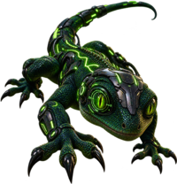

# chcrawl

A high-performance, correctness-first web crawler and reconnaissance engine written in native Go. Built for authorized security testing and deep application discovery.

Part of the CommonHuman-Lab toolkit.

## Why chcrawl?

Traditional crawlers often focus primarily on HTML links. chcrawl is designed to go further, combining correctness-focused crawling with deep discovery capabilities useful during authorized reconnaissance and penetration testing.

* **Correctness-first crawling** — predictable URL normalization, scope enforcement, redirect handling, retry behavior, and crawl-budget management.
* **Deep discovery** — HTML links, forms, JavaScript endpoints, WebSockets, OpenAPI specifications, and source maps.
* **Security workflow focused** — authentication helpers and discovery features designed for authorized application testing.
* **Controlled concurrency** — global and per-host concurrency limits, delays, configurable retry/backoff behavior, and crawl budgets.
* **Structured output** — JSONL records designed for pipelines, automation, and post-processing.
* **Flexible scope policies** — exact-origin, subdomain, allow/deny list, and regex-based scope controls.

## Installation

Requires Go 1.27+.

```bash
go install github.com/commonhuman-lab/chcrawl/cmd/chcrawl@latest
```

Or build from source:

```bash
git clone https://github.com/commonhuman-lab/chcrawl.git
cd chcrawl
go build -o chcrawl ./cmd/chcrawl
```

## Quick start

```bash
# Crawl a target
./chcrawl https://target.example

# Show the full flag reference
./chcrawl -h

# Crawl up to depth 5 with no page limit
./chcrawl -max-depth 5 -max-pages 0 https://target.example

# Respect robots.txt and allow insecure TLS certificates
./chcrawl -respect-robots-txt -insecure https://target.example

# Add an authenticated request header
./chcrawl -header "Authorization: Bearer tok" https://target.example

# Enable OpenAPI discovery and source-map recovery
./chcrawl -discover-openapi -recover-source-maps https://target.example

# Write structured JSONL output
./chcrawl -output result.jsonl https://target.example
```

Output is emitted as structured JSONL, with one result or discovery record per line.

### Key flags

`-concurrency`, `-per-host-concurrency`, `-max-pages`, `-max-depth`,
`-max-duration`, `-same-origin`, `-exclude`, `-proxy`, `-cookies`,
`-header` (repeatable), `-delay`, `-insecure`,
`-respect-robots-txt`, `-discover-openapi`, `-recover-source-maps`,
`-legacy-mode`.

`-legacy-mode` enables compatibility behavior using the earlier URL
normalization, crawl-budget, and retry semantics.

## Discovery capabilities

### HTML and page discovery

chcrawl extracts and resolves URLs from:

* `<a>`
* `<link>`
* `<script src>`
* ``
* `<iframe>`
* `<button formaction>`
* `dataKey flags: `-concurrency`, `-per-host-concurrency`, `-max-pages`,
`-max-depth`, `-max-duration`, `-same-origin`, `-exclude`, `-proxy`,
`-cookies`, `-header` (repeatable), `-delay`, `-insecure`,
`-respect-robots-txt`, `-discover-openapi`, `-recover-source-maps`,
`-legacy-mode` (switches to simpler normalization/budget/retry behavior).-href`, `data-url`, `data-link`, and `data-action`
* Meta-refresh redirects
* `<base href>` declarations
* A `<code>`-block API-path heuristic

Relative URLs are resolved correctly against the active page URL, including
`<base href>` handling.

Redirect chains are tracked and reported.

### Forms

Form discovery includes:

* Form action and method extraction
* Required-field defaulting
* Hidden-field handling
* CSRF token replay
* `<select>` fallback to the selected or first available option

### JavaScript endpoint discovery

chcrawl performs static JavaScript analysis to discover:

* Method and template-literal requests
* Static quoted paths
* Indirect variable concatenation
* Webpack chunk references and discovered assets
* WebSocket URLs

### OpenAPI and Swagger discovery

With `-discover-openapi`, chcrawl probes common OpenAPI and Swagger
specification locations and can follow embedded specification URLs exposed by
Swagger UI and Redoc.

Supported specifications include:

* Swagger / OpenAPI v2
* OpenAPI v3
* JSON and YAML documents
* `$ref` resolution

Discovered specifications are parsed and emitted as a standalone `openapi`
JSONL record containing the discovered endpoints and parameters.

The OpenAPI discovery pass runs independently of normal page traversal, so
specifications can be discovered even when they are not linked during the
crawl.

### Source-map recovery

With `-recover-source-maps`, chcrawl inspects crawled JavaScript files for
`.js.map` source maps and recovers source content exposed by those maps,
including pre-minification source where available.

Recovered source is noise-filtered to reduce irrelevant results:

* `node_modules`
* `webpack/runtime`
* `.spec` and `.test` files
* `/vendor/`

Recovered source-map discoveries are emitted as `source_map` records.

## Crawling and scope control

chcrawl supports configurable crawl behavior and scope enforcement:

* Exact-origin scope
* Subdomain scope
* Allow and deny lists
* Regex-based scope policies
* Global concurrency limits
* Per-host concurrency limits
* Request delays
* Configurable retry and backoff policies
* Page limits
* Depth limits
* Maximum crawl duration
* Optional `robots.txt` enforcement
* Proxy support
* Cookie support
* Custom request headers
* Insecure TLS support for authorized testing environments

## Authentication

chcrawl includes helpers for authenticated crawling:

* Form login with CSRF and hidden-field replay
* OAuth2 client-credentials bearer authentication
* HTTP Basic authentication

## Output

chcrawl is designed for automation and post-processing.

Results are emitted as structured JSONL, allowing discoveries to be streamed
into other tools or processed incrementally without waiting for the crawl to
finish.

Discovery records can include crawled URLs, redirects, discovered endpoints,
forms, OpenAPI specifications, source-map recoveries, and other structured
results.

## Legal and ethical use

Only run chcrawl against applications you own or have explicit authorization
to test.

Authorized use includes:

* Penetration testing engagements
* Bug bounty programs within their defined scope
* Internal security assessments
* CTF competitions
* Other explicitly authorized security research

The authors accept no liability for unauthorized or illegal use.

## License

Licensed under the [AGPLv3](LICENSE).

You are free to use, modify, and distribute chcrawl under the terms of the
license. See the [AGPLv3 license](LICENSE) for the full terms, including its
network-use source-availability requirements.

For commercial licensing, contact the author.
